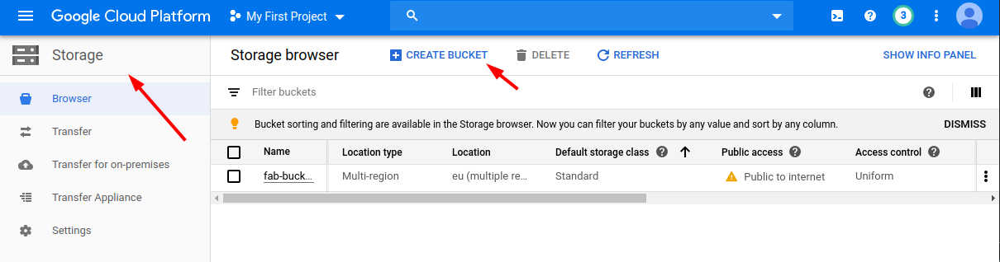
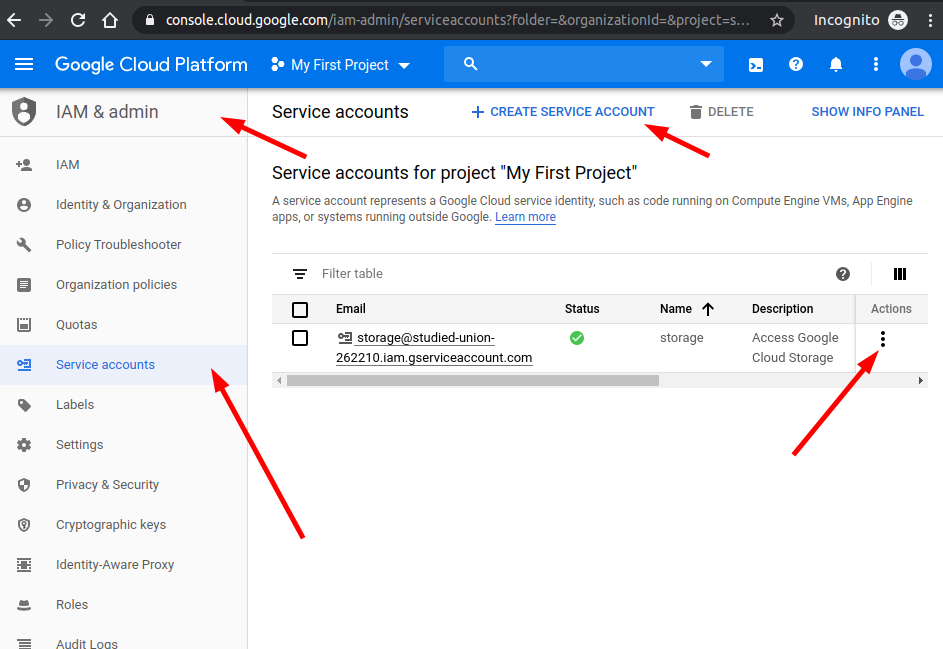
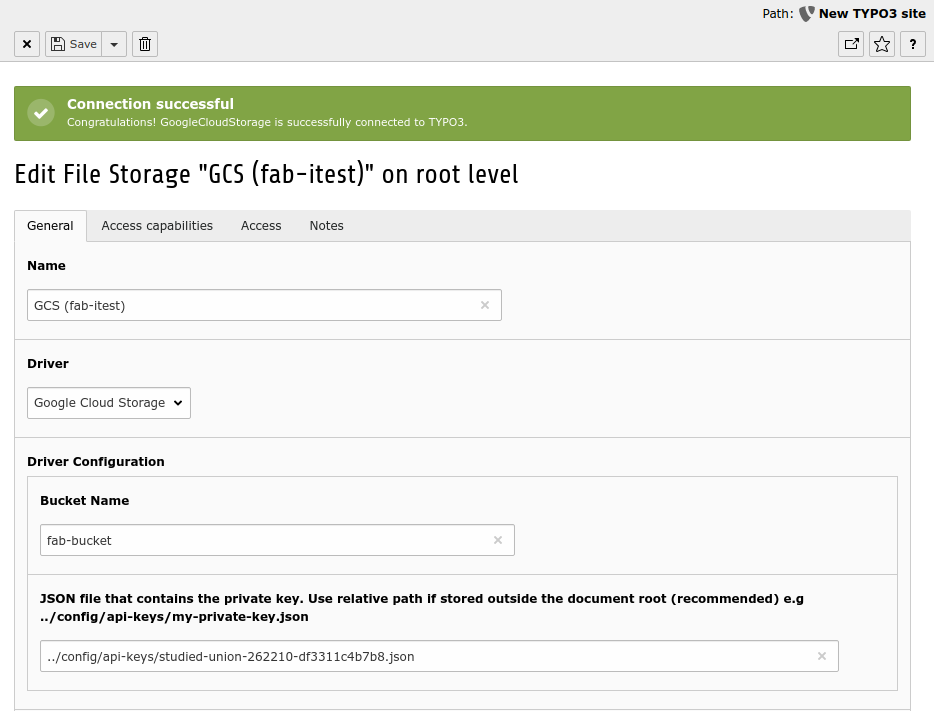

# Google Cloud Storage - FAL Driver

This extension provides a FAL driver to connect TYPO3 with [Google Cloud Storage](https://cloud.google.com/storage) API.
It offers various services among other:

* Store and deliver assets in a public GCS bucket
* CLI to to copy / move bunch of files from a local storage to a GCS bucket

This extension makes it possible to run a website without storing your assets  (images, PDFs etc.) on your local instance
but rather on a cloud infrastructure.

Installation
============

The extension should be installed via Composer

```
composer require visol/google-cloud-storage
```

Note that the extension will require the library `google/cloud-storage` and `guzzlehttp/psr7`. They will
automatically be downloaded into `vendor`.

Google Storage Configuration
============================

The configuration comes in two part. We firstly need to create a bucket. In a second step, we need to create a private /
public key to access this bucket.

Bucket Creation
---------------

A Storage should be created on the Google Console. Since it will be a public storage, it can be configured 
as a non ACL bucket. Make sure the newly created bucket is publicly readable. If not sure how to do it read the 
[Google documentation](https://cloud.google.com/storage/docs/access-control/making-data-public).  



Since it is more reproductible, we can perform the same on the command line.
Assuming `gsutil` and `gcloud` binaries are installed on your system, you can execute the following commands:

```shell script
# Check what google account is currently connected
gcloud auth list

# Log-in a new account.
gcloud auth login [MY_ACCOUNT]
```

Create a new bucket. I would recommend to create a uniform bucket-level access (vs ACL permission driven bucket) since 
we are in the context of the web we don't need a fine grained permission system.

```shell script
# -p: Specify the project with which your bucket will be associated. For example, my-project.
# -c: Specify the default storage class of your bucket. For example, NEARLINE.
# -l: Specify the location of your bucket. For example, US-EAST1.
# -b: Enable uniform bucket-level access for your bucket. (recommended for a website)
# gsutil mb -p [PROJECT_NAME] -c [STORAGE_CLASS] -l [BUCKET_LOCATION] -b on gs://[BUCKET_NAME]/
gsutil mb -p studied-union-262210 -l eu -b on gs://fab-bucket

# Create a dummy file and upload it to the bucket.
# Where `fab-bucket` is to be replaced with your bucket name.
echo "Hello you" > "foo.md"
gsutil cp foo.md gs://fab-bucket
gsutil ls gs://fab-bucket

# Make sure the bucket is publically available
gsutil iam ch allUsers:objectViewer gs://fab-bucket

# To see the current permissions
gsutil iam get gs://fab-bucket

# You should see something like this
#
#    {
#      "members": [
#        "allUsers"
#      ], 
#      "role": "roles/storage.objectViewer"
#    }


# Check the file is publically accessible 
curl https://storage.cloud.google.com/fab-bucket/foo.md

# Delete the dummy file from the bucket
gsutil rm gs://fab-bucket/foo.md
```


Access Key Creation
-------------------

Create a Service Account which will have access to the storage.
Generate a key stored in a JSON file. The file will be necessary later on to connect to the storage.
Download it and put it somewhere secure on your TYPO3 website (e.g inside the `/config/` folder).




Commands
--------

TYPO3 Configuration
====================

Once the extension is installed, we should create
a [file storage](https://docs.typo3.org/m/typo3/reference-coreapi/master/en-us/ApiOverview/Fal/Administration/Storages.html).

For a new "file storage" record, then:

* Pick the **GoogleCloudStorage** driver in the driver dropdown menu.
* Fill in the requested fields.
* **Important!** Configure the "folder for manipulated and temporary images" on a local driver where we have a **writeable** processed folder.
  Example: `1:/_processed`


Once the record is saved, you should see a message telling the connection could be successfully established.
You can now head to the File module list.
Notice the first time you click on a folder in the File list module,
it will take some time since the images must be fetched and downloaded for local processing.

Notice you can also use environment variable to configure the storage. 
The environment variable should be surrounded by %. Example `%BUCKET_NAME%` 



Logging
-------

For the debug purposes GoogleCloudStorage API calls are logged to better track and understand how and when the API is called.
It might be useful to check the log file in case of a low response time in the BE.

```
tail -f public/typo3temp/var/logs/google-cloud-storage.log
```

To decide: we now have log level INFO. We might consider "increasing" the level to "DEBUG".

Caveats and trouble shooting
----------------------------

* The first time a folder is clicked in the File list module,
 files must be retrieved from Google Cloud storage to be locally processed and thumbnails generated.
 Be patient if you have many files to display.

CLI Command
-----------

Move bunch of images from a local storage to a Google cloud bucket.

**CAUTIOUS!**
1. Moving means: we are "manually" uploading a file
to the GoogleCloudStorage storage and "manually" (= via SQL request) deleting the one from the local storage.
Finally we are changing the `sys_file.storage value` to the cloudinary storage id.
Consequently, the file uid will be kept. File references are not touched.


```shell script
./vendor/bin/typo3 gcs:move 1 2
# where 1 is the source storage (local)
# and 2 is the GCS storage 
```

The extension provides a tool to copy a bunch of files from one storage to an another.
This can be achieved with this command:

```shell script
./vendor/bin/typo3 gcs:copy 1 2
# where 1 is the source storage (local)
# and 2 is the GCS storage

# Ouptut:
Copying 64 files from storage "fileadmin/ (auto-created)" (1) to "GoogleCloudStorage Storage (fabidule)" (2)
Copying /introduction/images/typo3-book-backend-login.png
Copying /introduction/images/content/content-quote.png
...
Number of file copied: 64
```

Development tools
-----------------

Type command `make` at the source of the extension to display utility commands related to code formatting.

```
Usage:
 make [target]

Available targets:
 help:           Help
 lint:           Display formatting issues in detail
 lint-summary:   Display a summary of formatting issues
 lint-fix:       Automatically fix code formatting issues
```

Web Hook
--------

Whenever uploading or editing a file through the GoogleCloudStorage Manager you can configure an URL
as a web hook to be called to invalidate the cache in TYPO3.
This is highly recommended to keep the data consistent between GoogleCloudStorage and TYPO3.

```shell script
https://domain.tld/?type=1573555440
```
**Beware**: do not rename, move or delete file in the GoogleCloudStorage Manager. TYPO3 will not know it as currently
implement. Uploading a new file will not be a problem though.

Source of inspiration
---------------------

Google Cloud Storage Adaptor for Neos and Flow

https://github.com/flownative/flow-google-cloudstorage
